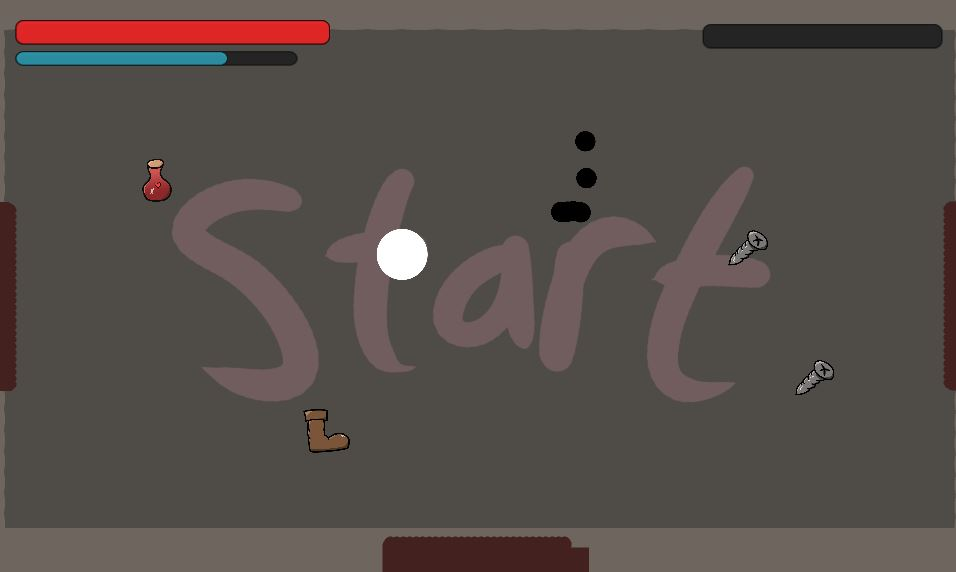

  
# 
Unity Project for the tools versioning course

## 
About the game

... is a 2D top-down cyberpunk game which you're controlling a **katana master**.
With him, you will take down your enemies by using his favorite weapons :
  * His *katana* which you'll dash through your enemies to kill them for example
  * His *shurikens* which you'll throw at your enemies to hurt them too and much more...

Using your abilities by taking down enemies will allow you to charge up your **fury bar** and when this is at its maximum you'll do so much **more damage** that you couldn't imagine.

But careful ! You have a **stamina bar** which allows you to use your spells ! Use it **wisely** !

In order to beat your enemies, you'll have to find your way through buildings to defeat a much bigger enemy !

  

<a href=/#top>Back to top</a>

## Plugin added
  
We intalled the Inspector Gadgets Lite plugin, you can find it here :
  
[Inspector Gadgets Lite](https://assetstore.unity.com/packages/tools/gui/inspector-gadgets-lite-82896)
  

<a href=/#top>Back to top</a>

  

## Contact

## Game Programmers

Morigan Letourneau - [Profile](https://www.linkedin.com/in/morigan-letourneau-2188881ba/)

Julien Aberton - [Profile](https://www.linkedin.com/in/julien-aberton-9aa26b207/)

Freddy Maupou - [Profile](https://www.linkedin.com/in/freddymaupou/)

## Game Artists

Lilian Clairville - [Profile](https://www.linkedin.com/in/lilian-clairville-a6395a19b/)

Gabriel Kenig

<a href=/#top>Back to top</a>

## Project
Project Link : [click here](https://github.com/bakouzee/outils-versioning-project)

<a href=/#top>Back to top</a>

